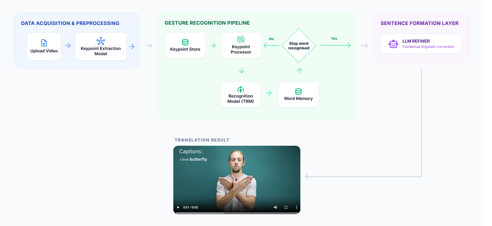
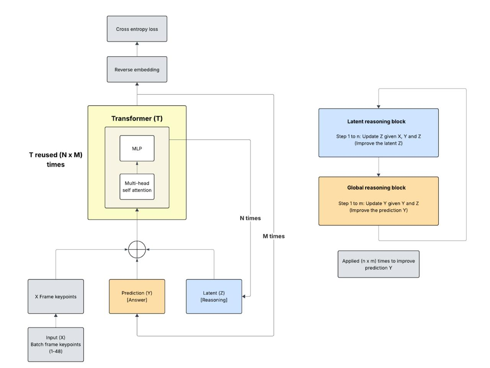

# ASL-TRM: Transformer Reasoning Model for ASL Gesture Recognition

ASL-TRM is a lightweight, Transformer-based gesture recognition framework built for American Sign Language (ASL) classification using pose and motion features. The system processes ASL video input, extracts structured spatial–temporal representations, and applies transformer-based reasoning to translate signed gestures into text.

At its core, ASL-TRM leverages an efficient architecture, TRM-Micro, designed for scalability while maintaining strong recognition accuracy. By modeling temporal dependencies across frames, the framework enables reliable video-to-text translation from ASL gestures.

---

## Architecture Overview




---

## Dataset:

This project uses the **ASL-Citizen dataset** from Microsoft, a large collection of sign language video samples and corresponding gloss annotations.

🔗 [**Dataset**](https://www.microsoft.com/en-us/research/project/asl-citizen/) 

🔗 [**Dataset Description**](https://www.microsoft.com/en-us/research/project/asl-citizen/dataset-description/)

---

## Inspiration

1. *Less is More: Recursive Reasoning with Tiny Networks*] [(Link)](https://arxiv.org/pdf/2510.04871)
   
   This paper introduces a compact Transformer reasoning model designed to learn structured reasoning through latent token abstraction and recursive interaction. Although the original TRM was developed for general reasoning tasks and not for gesture recognition, its core ideas — latent reasoning slots, shared Transformer layers, and efficient recursive updates directly influenced how we built TRM-Micro for ASL. We adapted these principles to handle spatio-temporal pose and motion features, enabling lightweight yet expressive sequence reasoning in the context of sign language translation.

2. *ASL Citizen: A Community-Sourced Dataset for Advancing Isolated Sign Language Recognition - STGCN Baseline* [(Link)](https://arxiv.org/pdf/2304.05934)

   This paper introduces ASL Citizen, a large-scale dataset for isolated sign language recognition containing 83,399 videos covering 2731 ASL signs collected from diverse signers. The work frames sign recognition as a dictionary retrieval problem and provides a challenging real-world benchmark for ASL recognition models. The dataset forms the foundation of our experiments, enabling evaluation of TRM-Micro on large-vocabulary sign recognition tasks.

3. *Word-Level Deep Sign Language Recognition — TGCN Baseline* [(Link)](https://arxiv.org/pdf/1910.11006)

   This paper presents a Temporal Graph Convolutional Network (TGCN) for sign language recognition that operates on skeleton/pose features extracted from video. The TGCN models spatial dependencies between joints and temporal dynamics across frames, making it a strong baseline for pose-based action/gesture recognition tasks. It serves as our baseline model because it demonstrates how pose representations can be leveraged for sign language classification, providing a meaningful point of comparison for the performance of TRM-Micro.

---

## Model Evaluation

We evaluate TRM-Micro on multiple ASL classification benchmarks of increasing vocabulary size:
- ASL 100
- ASL 300
- ASL 1000
- ASL 2000

### Evaluation Metrics

We report Top-1, Top-5, and Top-10 accuracy:

- Top-1 → Correct label is the highest-confidence prediction
- Top-5 → Correct label appears within top 5 predictions
- Top-10 → Correct label appears within top 10 predictions

### Baseline Evaluation

### TRM-Micro and TGCN on WLASL Dataset
**TRM-Micro**
| Metric     | WLASL 100 | WLASL 300 | WLASL 1000 | WLASL 2000 |
| ---------- | ------- | ------- | -------- | -------- |
| **Top-1**  | 60.47%  | 57.49%  | 45.20%   | 33.41%   |
| **Top-5**  | 86.43%  | 84.43%  | 73.61%   | 63.81%   |
| **Top-10** | 90.70%  | 87.28%  | 80.38%   | 73.39%   |

**TGCN**
| Metric     | WLASL 100 | WLASL 300 | WLASL 1000 | WLASL 2000 |
| ---------- | ------- | ------- | -------- | -------- |
| **Top-1**  | 55.43%  | 38.32%  | 34.86%   | 23.65%   |
| **Top-5**  | 78.68%  | 67.51%  | 61.73%   | 51.75%   |
| **Top-10** | 87.6%  | 79.64%  | 71.91%   | 62.24%   |

### TRM-Micro v3 on ASL-Citizen Dataset
| Dataset      | ST-GCN | TRM-Micro v3 |
| ------------ | ------------ | ------------ |
| **Top-1**   | 59.52%      | 61.46%     |
| **Top-5**   | 82.68%     | 82.32%      |
| **Top-10**  | 88.13%      | 86.54%     |


### TRM-Micro v2
| Metric     | ASL 100 | ASL 300 | ASL 1000 | ASL 2000 |
| ---------- | ------- | ------- | -------- | -------- |
| **Top-1**  | 73.89%  | 70.67%  | 67.86%   | 64.15%   |
| **Top-5**  | 89.98%  | 88.09%  | 86.38%   | 84.12%   |
| **Top-10** | 93.01%  | 91.47%  | 90.22%   | 88.03%   |


### TRM-Micro v1
| Metric     | ASL 100 | ASL 300 | ASL 1000 | ASL 2000 |
| ---------- | ------- | ------- | -------- | -------- |
| **Top-1**  | 73.40%  | 67.31%  | 64.95%   | 59.28%   |
| **Top-5**  | 88.63%  | 85.13%  | 83.72%   | 80.50%   |
| **Top-10** | 92.41%  | 89.36%  | 88.23%   | 85.42%   |


### Model Size

| Vocab size     | TGCN | ST-GCN | TRM-Micro v3 |
| ---------- | ------- | ------- | -------- |
| 100  | 461,433  | 3,111,998  | 622,261  |
| 300  | 512,833 | 3,163,398 | 654,461  |
| 1000 | 692,733  | 3,343,298  | 767,161   |
| 2000 | 949,733  | 3,600,298  | 928,161  |

---

## Installation

Requires Python 3.11

```bash
# Clone the repo
git clone https://github.com/Ak79p/asl_trm.git
cd asl_trm

# Install uv (if not already installed)
# https://docs.astral.sh/uv/getting-started/installation/
brew install uv

# Create virtual environment
uv sync

# Launch the Streamlit interface
uv run streamlit run app.py
```

Optional: Enable AI Sentence Generation (Gemini)

To use the AI sentence refinement layer, you need a Google Gemini API key.

Step 1: Get API Key
- Go to Google AI Studio: https://aistudio.google.com/
- Create a new API key

Step 2: Set Environment Variable
```bash
export GEMINI_API_KEY="your_api_key_here"
```
---

## How to Evaluate

Follow the steps below to reproduce evaluation results.

1. Download the [feature](https://drive.google.com/file/d/1DQTHTcbqugvTPzRvrdfwFWK_J7d0BV04/view?usp=sharing) archive and extract it.

Place the extracted features_cache/ folder inside:
```bash
data/
```

Directory structure should look like:
```bash
asl-trm/
│
├── data/
│   ├── features_cache/
│   └── build_features.py
```

2. Build Dataset Features

```bash
cd data
python build_features.py --dataset asl-citizen
python build_features.py --dataset wlasl100
python build_features.py --dataset wlasl300
python build_features.py --dataset wlasl1000
python build_features.py --dataset wlasl2000
```

3. Run Evaluation
### Evaluating ASL-Citizen Datasets
```bash
cd ..
python -m eval.eval_trm --dataset asl-citizen
```

### Evaluating WLASL Datasets
```bash
python -m eval.eval_trm --dataset wlasl100
python -m eval.eval_trm --dataset wlasl300
python -m eval.eval_trm --dataset wlasl1000
python -m eval.eval_trm --dataset wlasl2000
```

---

### Evaluating Sentence level accuracy
We have created synthetic sentence level videos by stitching word level videos, having maximum of 5 words. We have used testset of asl-citizen for creating sentence videos.

Sentence details are mentioned at **data\app_asl_sentences_1000.json**
> Note: Stop word is defined as 5 continuous frames when no hand keypoints are detected.

| Total Videos   | BLUE1 | ROUGE1 |
| ---------- | ------- | ------- |
| 910        | 0.4808  | 0.5663  |

#### Evaluation command:
Download video data from [here]() at data/

```
bash eval/run_pipelines.sh -p sliding_in_boundary 
```

Link to inference data: https://drive.google.com/drive/folders/1zPIQA9Yu3djh3VNsoqjXwpwDs2ZVp8mX?usp=sharing

## Future work
- Extend to real-world continuous ASL using improved temporal modeling and boundary detection.
- Enhance sequence learning (e.g., attention/transformers) for better context across signs.

---

## Acknowledgements

This work builds upon:

- Microsoft’s ASL-Citizen dataset [Link](https://www.microsoft.com/en-us/research/project/asl-citizen/) 
- MediaPipe Holistic keypoint extraction [Link](https://ai.google.dev/edge/mediapipe/solutions/guide) 
